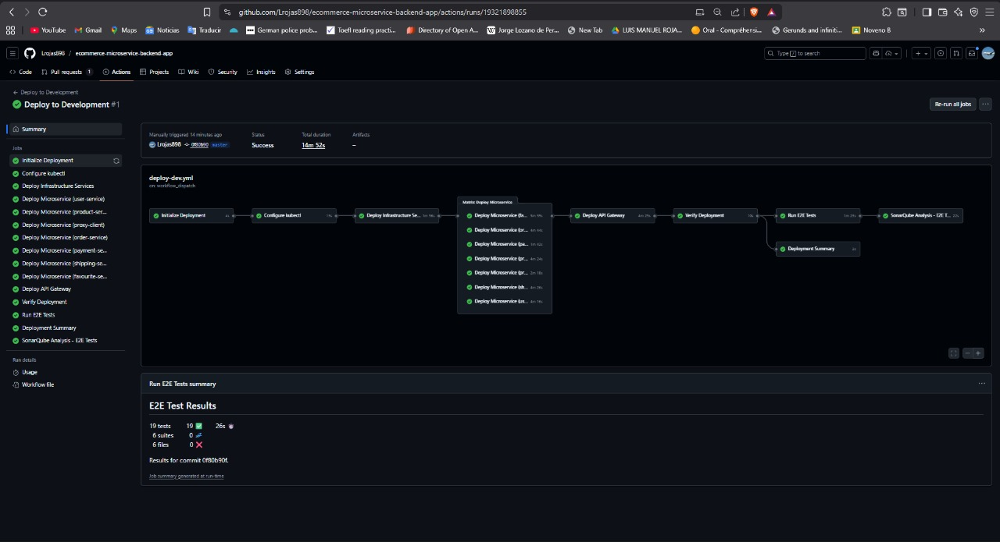
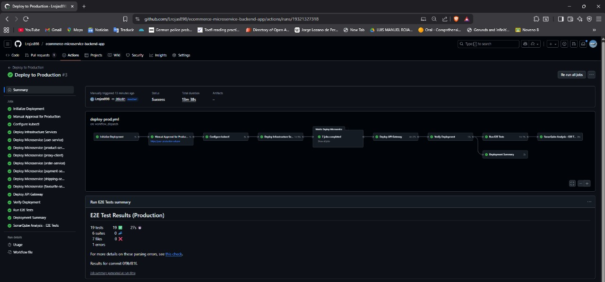
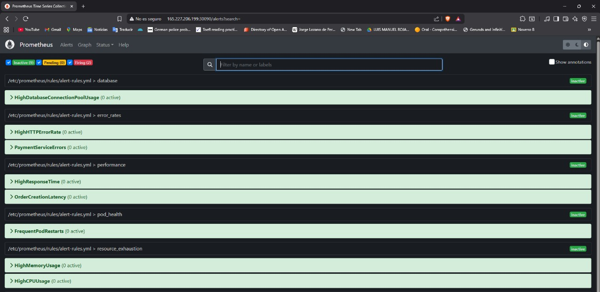
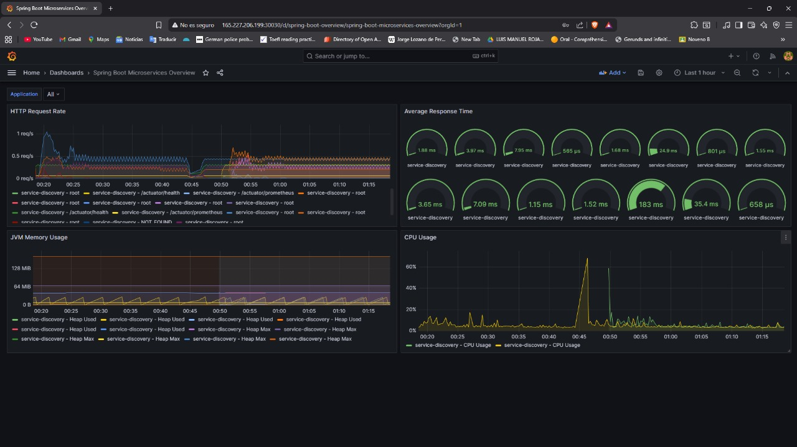
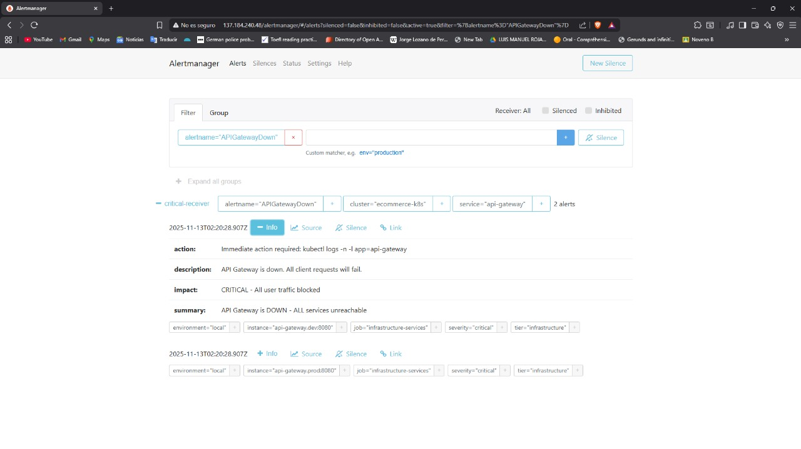

# Informe Final – Plataforma E‑Commerce Microservicios

## 1. Visión General

Este documento unifica el trabajo realizado sobre el taller 3 de la materia de ingeniería de software V para el repositorio de e-commerce microservice app

- **Arquitectura**: Plataforma de e‑commerce basada en microservicios Java/Spring Boot desplegada en Kubernetes (DigitalOcean Kubernetes – DOKS, runtime `containerd`).
- **Namespaces principales**:
  - `dev`: entorno de desarrollo.
  - `prod`: entorno de producción.
  - `monitoring`: Prometheus, Grafana, Alertmanager.
  - `logging`: Elasticsearch, Kibana, Filebeat (configurado pero aún no desplegado).
  - `tracing`: Jaeger (distributed tracing).
- **Microservicios**:
  - `service-discovery` (Eureka Server).
  - `api-gateway` (Spring Cloud Gateway).
  - `user-service`, `product-service`, `order-service`, `payment-service`, `shipping-service`, `favourite-service`.
  - `proxy-client` (frontend/backend BFF con seguridad JWT).
- **Base de datos**:
  - PostgreSQL en `prod` con PVC de 10Gi (un despliegue `postgresql` y un Service dedicado).
  - Uso de H2 en memoria para perfiles de desarrollo en varios servicios.
- **Registro de imágenes**: Docker Hub (`luisrojasc/*`).
- **CI/CD**: Jenkins (Taller 2) y GitHub Actions (estado actual), ambos integrados con SonarQube, Trivy y Kubernetes.

---

## 2. Patrones de Arquitectura Implementados

### 2.1 Service Registry & Discovery

- **Patrón**: Service Registry & Discovery.
- **Tecnología**: Netflix Eureka Server (`spring-cloud-starter-netflix-eureka-server` y `eureka-client`).
- **Detalles**:
  - `service-discovery` expone Eureka en el puerto 8761.
  - Cada microservicio se registra como `SERVICE-NAME` (ej. `USER-SERVICE`, `PRODUCT-SERVICE`).
  - Heartbeats periódicos, expiración de instancias y self‑preservation configurados.

### 2.2 API Gateway Pattern

- **Tecnología**: Spring Cloud Gateway (reactivo) + Eureka + Spring Cloud LoadBalancer.
- **Responsabilidades**:
  - Punto único de entrada HTTP.
  - Enrutamiento basado en path hacia `lb://SERVICE-NAME`.
  - CORS global habilitado para desarrollo.
  - Filtros de cabeceras y reescritura de paths.
- **Integración con Ingress**:
  - En Kubernetes, el Ingress NGINX enruta `/dev/...` y `/...` hacia `api-gateway:80`.

### 2.3 Load Balancing Client‑side

- **Tecnología**: Spring Cloud LoadBalancer (`@LoadBalanced RestTemplate`).
- **Funcionamiento**:
  - Las URLs tipo `http://ORDER-SERVICE/...` se resuelven mediante Eureka y el balanceador client‑side.
  - Eager loading habilitado para ciertos clientes para reducir latencia en el primer request.

### 2.4 Circuit Breaker Pattern

- **Tecnología**: Resilience4j vía `spring-cloud-starter-circuitbreaker-resilience4j`.
- **Configuración**:
  - Circuit breakers por servicio (`apiGateway`, `orderService`, `paymentService`, etc.).
  - Parámetros: `failure-rate-threshold`, `sliding-window-size`, `wait-duration-in-open-state`, etc.
- **Integración**:
  - Estado del circuito expuesto en `/actuator/health` bajo `circuitBreakers`.
  - Métricas expuestas a Prometheus (`resilience4j_circuitbreaker_*`).

### 2.5 External Configuration (Config Server)

- **Tecnología**: Spring Cloud Config Server (`cloud-config`).
- **Backend**: Repositorio Git con archivos `application*.yml` y `{service}*.yml`.
- **Clientes**:
  - Todos los servicios usan `spring.config.import=optional:configserver:...` para cargar configuración centralizada.

### 2.6 Persistencia y Flyway

- **Patrón**: Database per Service (a nivel lógico).
- **Tecnología**: Spring Data JPA + Flyway + PostgreSQL/H2.
- **Características**:
  - Migraciones versionadas (`db/migration/V*_*.sql`) por servicio.
  - HikariCP configurado con límites razonables de pool.
  - En `prod`, se usa PostgreSQL con parámetros ajustados para producción.

### 2.7 Seguridad (JWT y Propagación)

- **JWT**:
  - Implementado en `proxy-client` con `spring-boot-starter-security` y `jjwt`.
  - Tokens firmados con HS512; expiración configurable.
- **Propagación de Authorization**:
  - Interceptor de `RestTemplate` que copia el header `Authorization` de la request entrante a las llamadas salientes (`AuthorizationHeaderInterceptor`).
  - Garantiza que, una vez autenticado un usuario, las llamadas service‑to‑service preserven el contexto de seguridad.

---

## 3. Acceso y Estado de Servicios

### 3.1 Ingress y Load Balancer

- **Load Balancer**: IP pública `137.184.240.48` (DigitalOcean).
- **Ingress NGINX**:
  - Namespace `dev`:
    - Paths `/dev(/|$)(.*)` → `api-gateway:80`, rewrite `/$2`.
  - Namespace `monitoring`:
    - `/grafana(/|$)(.*)` → `grafana:3000`.
    - `/prometheus(/|$)(.*)` → `prometheus:9090`.
    - `/alertmanager(/|$)(.*)` → `alertmanager:9093`.
  - Namespace `prod`:
    - Paths `/app/...` sin prefijo `/dev` hacia `api-gateway`.

### 3.2 URLs por Entorno

- **Dev** (`namespace: dev`):
  - API Gateway (API): `http://137.184.240.48/dev/app/api/`.
  - Frontend (`proxy-client`): `http://137.184.240.48/dev/app/`.
  - Servicios directos (ejemplos):
    - `http://137.184.240.48/dev/user-service/api/users`.
    - `http://137.184.240.48/dev/order-service/api/orders`.
  - Health checks: `.../dev/{service}/actuator/health`.

- **Prod** (`namespace: prod`):
  - API Gateway (API): `http://137.184.240.48/app/api/`.
  - Sin prefijo `/dev` en las rutas.

### 3.3 Acceso a Servicios de Observabilidad

- **Grafana**: `http://137.184.240.48/grafana/`.
- **Prometheus**: `http://137.184.240.48/prometheus/`.
- **Alertmanager**: `http://137.184.240.48/alertmanager/`.

Además, se dispone de acceso interno con `kubectl port-forward` para depuración local.

---

## 4. Estrategia de Branching, Versionado y CI/CD

### 4.1 Branching Strategy

- **`master`**: Código en estado de producción estable.
- **`develop`**: Integración continua; refleja el entorno `dev`.
- **`feature/*`**: Desarrollo de funcionalidades.
- **`release/*`**: Preparación de releases; despliegue a un entorno de staging/QA (conceptual).
- **`hotfix/*`**: Correcciones urgentes sobre `master`.

### 4.2 Versionado

- **SemVer (`MAJOR.MINOR.PATCH`)** con conventional commits:
  - `feat`: cambios de funcionalidad (minor).
  - `fix`: correcciones de errores (patch).
  - `feat!` o `BREAKING CHANGE`: cambios incompatibles (major).

### 4.3 GitHub Actions (Estado Actual)

- **Workflow de Build** (`.github/workflows/build.yml`):
  - Detecta servicios cambiados.
  - Ejecuta build y tests por microservicio.
  - Construye y publica imágenes Docker (`<service>:<version_tag>`, `latest`).
  - Corre análisis SonarQube y escaneo Trivy.
  - En `master`, calcula el siguiente tag (major/minor/patch) a partir de los mensajes de commit (convencionales) y genera automáticamente:
    - Un **tag Git anotado** para el release (p.ej. `v1.2.3`).
    - Un archivo `RELEASE_NOTES.md` con el resumen de cambios (Features, Fixes, Maintenance) y las imágenes Docker generadas por servicio.
    - Un **GitHub Release** asociado al tag, usando `RELEASE_NOTES.md` como cuerpo.
  - Esta lógica fue implementada específicamente para el Taller 3, evitando herramientas externas (semver CLI) y usando solo shell y GitHub Actions.



- **Workflows de Deploy** (`deploy-dev.yml`, `deploy-prod.yml`):
  - Reciben como input un JSON `service_versions` para fijar versiones por servicio.
  - Configuran `kubectl` vía `doctl` hacia el cluster `ecommerce-microservices-prod-cluster`.
  - Despliegan primero `service-discovery`, luego microservicios, y finalmente `api-gateway`.
  - `deploy-prod.yml` incluye opciones para saltar E2E o forzar despliegue de todos los servicios.



---

## 5. Observabilidad: Métricas, Logging y Tracing

### 5.1 Monitoreo con Prometheus y Grafana

- **Prometheus**:
  - Desplegado en `monitoring` con PVC (`prometheus-pvc`).
  - Scrapea `/actuator/prometheus` de todos los servicios (`dev` y `prod`).
  - Configurado con rules para alertas (latencia, errores 5xx, CPU, memoria, circuit breakers, etc.).



- **Grafana**:
  - Datasource Prometheus preconfigurado.
  - Dashboards para Spring Boot, JVM, HTTP, circuit breakers y overview de microservicios.
  - Autenticación básica (credenciales por defecto documentadas, a endurecer en producción).



- **Alertmanager**:
  - Alertas críticas (`ServiceDown`, `APIGatewayDown`, `EurekaDown`, `HighHTTPErrorRate`, etc.).
  - Alertas de warning para degradación de performance y problemas de recursos.



### 5.2 Logging con ELK

- **Estado**:
  - Directorio `infrastructure/kubernetes/logging/` con manifests para Elasticsearch, Kibana, Filebeat.
  - Namespace `logging` creado.
  - Aún no se han desplegado los pods (0 pods activos).

- **Plan de despliegue**:
  - Uso del script `deploy-elk.sh` para desplegar:
    - Elasticsearch (single-node, PVC 5Gi).
    - Kibana (UI).
    - Filebeat como DaemonSet (recolección de `/var/log/containers`).
  - (Opcional) Crear un Ingress `logging-ingress` para exponer Kibana en `http://137.184.240.48/kibana/`.

### 5.3 Distributed Tracing con Jaeger

- **Stack de tracing**:
  - Jaeger all‑in‑one en `tracing` (collector, query y UI).
  - Integración con Spring Cloud Sleuth y Zipkin protocol.

- **Servicios trazados**:
  - `api-gateway`, `user-service`, `product-service`, `order-service`, `payment-service`, `service-discovery` y otros según despliegue.

- **Uso operativo**:
  - Jaeger UI (via port‑forward) permite:
    - Buscar traces por servicio, operación, tags (`error=true`, `http.status_code=500`, etc.).
    - Analizar la cadena completa de spans de un flujo (e.g., compra completa).

- **Correlación Logs‑Traces‑Métricas**:
  - Trace ID y Span ID en los logs (`[service,traceId,spanId]`).
  - Flujos de debug: alerta en Grafana → logs en Kibana → trace en Jaeger → causa raíz.

---

## 6. Estrategia de Pruebas

### 6.1 Pirámide de Pruebas

- **Unit Tests**:
  - JUnit 5 + Mockito + AssertJ + JaCoCo.
  - Cobertura en servicios clave (order, payment, product, user, favourites, etc.).

- **Integration Tests**:
  - Spring Boot Test + Testcontainers (MySQL/PostgreSQL) para relaciones entre servicios y repositorios.
  - Ejemplos: Favourite ↔ Product, Payment ↔ Order, Shipping ↔ Order/Product.

- **End‑to‑End (E2E)**:
  - Ubicación: `tests/src/test/java/com/selimhorri/app/e2e/*E2ETest.java`.
  - Cubre flujos:
    - Registro y autenticación de usuarios.
    - Navegación de productos.
    - Creación de órdenes.
    - Procesamiento de pagos.
    - Envíos.
  - Se ejecutan automáticamente en el pipeline de `prod` (GitHub Actions y Jenkins) con `port-forward` al `api-gateway`.
  - En las últimas ejecuciones sobre `prod` se obtuvo **100% de éxito** en 19 pruebas E2E (registro, login, navegación, órdenes, pagos y envíos) con tiempos medios por test ≈ 2–3 segundos, validando que los flujos críticos están operativos en el entorno real.

### 6.2 Pruebas de Performance (Locust)

- **Ubicación**: `tests/performance/locustfile.py`.
- **Escenarios implementados**:
  - `ProductServiceLoadTest`: carga focalizada en catálogo de productos.
  - `OrderServiceStressTest`: altas tasas de creación de órdenes (Black Friday / flash sales).
  - `UserAuthenticationLoadTest`: login, registro y consultas de perfil.
  - `CompletePurchaseFlow` + `ECommercePurchaseUser`: flujo de compra end‑to‑end (browse → cart → order → payment → shipping).
  - `MixedWorkloadUser`: distribución realista de comportamiento (browse mayoritario, pocos completes).
- **Métricas objetivo**:
  - Tasa de error ajustada (ignorando 4xx esperados) < 5%.
  - p95 de tiempo de respuesta < 1s para endpoints de lectura y aceptable para flujos complejos.
  - No degradación significativa en pruebas de endurance.


Durante las pruebas ejecutadas para el Taller:

- Se identificaron errores 400 esperados (IDs aleatorios inexistentes) y errores 500 reales en algunos endpoints, diferenciándolos en el análisis de Locust.
- Se corrigieron problemas de conectividad entre Jenkins/Locust y el cluster (port-forward y rutas), hasta lograr pruebas estables contra el API Gateway del cluster.

---

## 7. Seguridad: Escaneo de Vulnerabilidades

### 7.1 Trivy en GitHub Actions

- **Integración**:
  - El workflow de build (`build.yml`) ejecuta Trivy sobre las imágenes construidas.
  - Resultados exportados en formato SARIF a la pestaña **Security → Code scanning**.
  - También se generan reportes legibles como artifacts.

- **Workflows adicionales**:
  - Workflow dedicado de security‑scan (programado o manual) que:
    - Escanea imágenes `latest` en Docker Hub.
    - Puede crear issues automáticos para vulnerabilidades CRITICAL.

### 7.2 Uso Local

- Instalación de Trivy (apt/brew) y uso de comandos como:

```bash
trivy image luisrojasc/user-service:latest
trivy image --severity CRITICAL,HIGH luisrojasc/user-service:latest
./scripts/scan-all-services.sh
```

### 7.3 Remediación

- **Dependencias de aplicación**:
  - Actualización de versiones en `pom.xml` (Spring, Jackson, etc.).
- **Sistema base (OS)**:
  - Cambio de imagen base en Dockerfile a variantes más recientes o distroless.
- **Proceso**:
  - Rebuild de imagen → Re‑scan → Push → Verificación en GitHub Security.

---

## 8. Procedimientos de Rollback

### 8.1 Criterios y Tipos

- **Rollback inmediato (crítico)** cuando:
  - El API Gateway no responde o el error 5xx supera umbrales definidos.
  - Fallos críticos en producción que bloquean el negocio.
  - E2E tests fallan de forma masiva tras un despliegue.

- **Tipos de rollback**:
  - Rollback de deployment individual.
  - Rollback de API Gateway (prioridad máxima).
  - Rollback de base de datos (schema/datos) con PostgreSQL.
  - Rollback de configuración (ConfigMaps, Secrets, Ingress).
  - Rollback completo del sistema (todos los servicios a un tag previo).

### 8.2 Herramientas de Rollback

- **Kubernetes**:
  - `kubectl rollout history/undo/status` sobre `deployment`.
  - Escalado de servicios para realizar restauraciones de BD.

- **GitHub Actions**:
  - Re-ejecutar `deploy-prod.yml` con `service_versions` apuntando a versiones previas.
  - Integración posible con `gh workflow run` para automatizar.

- **Scripts de ayuda** (documentados en `ROLLBACK_PROCEDURES.md`):
  - `quick-rollback.sh`: rollback rápido de un servicio concreto.
  - `rollback-to-tag.sh`: fijar imagen `<service>:<TAG>` para un servicio.
  - Script de rollback completo que alinea todos los servicios a un `PREVIOUS_TAG` común.

### 8.3 Validación Post‑Rollback

- Verificación de pods (`kubectl get pods -n prod`).
- Health checks en `/actuator/health`.
- Revisión de Eureka para asegurar que todos los servicios están registrados.
- Ejecución de pruebas E2E críticas.
- Revisión de métricas en Prometheus y logs (cuando ELK esté desplegado).

### 8.4 Tiempos Objetivo (RTO)

- Servicio individual: ≈ 5 minutos.
- API Gateway: ≈ 3 minutos.
- Rollback completo: 15–20 minutos.
- Base de datos (schema completo): 30–60 minutos.

---

## 9. Estado Actual vs. Trabajo Pendiente

### 9.1 Implementado

- Patrones de microservicios (Eureka, Gateway, Load Balancer, Circuit Breaker, Config Server).
- Observabilidad con Prometheus + Grafana + Jaeger.
- Stack de CI/CD con Jenkins (Taller 2) y GitHub Actions (estado actual) que cubre:
  - Build multi‑servicio, tests, análisis de calidad y seguridad.
  - Despliegue a `dev` y `prod` controlado.
  - Generación automática de release notes, tags y GitHub Releases en `master`, implementada y probada específicamente para el Taller 3.
- Estrategia de pruebas: unitarias, integración, E2E y performance (Locust) operativas.
- Planes de rollback detallados alineados con la infraestructura real.
- Integración de Trivy para escaneo de vulnerabilidades en imágenes.

---

**Última actualización**: 25 de Noviembre de 2025

Este informe consolida la arquitectura, prácticas de CI/CD, observabilidad, seguridad y planes de rollback de la plataforma de e‑commerce, sirviendo como referencia única para el Taller 3.
